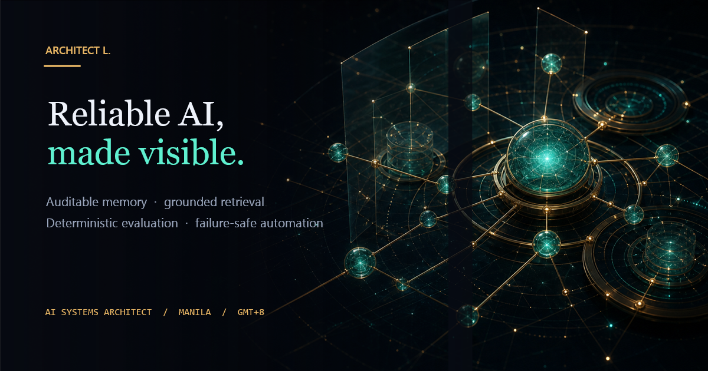

<div align="center">

# Architect L. · AI Systems Architect

**A live portfolio front door for reliable AI systems.**

[](https://github.com/Lancimoun/Lancimoun.github.io/actions/workflows/ci.yml)
[](https://lancimoun.github.io/)
[](https://github.com/Lancimoun/Lancimoun.github.io/commits/main)
[](index.html)

[Open the live portfolio](https://lancimoun.github.io/)

</div>



## What this site is

This is the public entry point to Architect L.'s AI engineering work. It
presents the FORGE family as a set of reliability proofs rather than a gallery
of disconnected demos:

- auditable memory that records why beliefs changed;
- grounded retrieval that attaches answers to evidence;
- deterministic evaluation that exposes drift and unsupported claims;
- failure-safe automation with idempotency, bounded retries, and approvals;
- observable systems whose important claims can be verified.

The live site links directly to the deployed systems and their source
repositories so the story ends in working software, not a mock dashboard.

## Experience

The front door is a dependency-free neural observatory built with native HTML,
CSS, canvas, and JavaScript. Its visual system uses deep ink, warm brass, and
teal live-signal accents to keep motion subordinate to the evidence.

The cinematic layer has explicit operational boundaries:

- `prefers-reduced-motion` paints one stable frame instead of running a loop;
- the canvas is decorative and hidden from assistive technology;
- keyboard users receive a first-focus skip link;
- project links are HTTPS and new-tab links use `noopener`;
- the layout contracts safely to small-phone widths.

## Social preview

Shared links now use a real 1200×630 Open Graph and Twitter card:

`assets/architect-l-social-card.png`

The card contains no volatile test counts or deployment totals. Its copy states
the durable portfolio thesis—reliable AI made visible—while the page metadata
supplies the current title and description.

## Architecture

```text
index.html
├── discovery + social metadata
├── design tokens and responsive layout
├── semantic portfolio content
├── raw-canvas neural field
└── reduced-motion and visibility controls

assets/
└── architect-l-social-card.png

tests/
└── test_site.py
```

There is no package install, bundler, external stylesheet, runtime script, or
client-side framework.

## Verification

Run the provider-free repository contracts:

```powershell
python -m unittest discover -s tests -v
```

The suite checks the document shell, semantic landmarks, link safety, external
runtime dependencies, reduced-motion behavior, public claim literals, social
metadata, the preview asset's PNG signature, and its exact 1200×630 dimensions.

From the parent `REVIVAL CLAUDE` workspace, run the fleet-level gates:

```powershell
python LOOP\audit_frontend.py --advisory
python LOOP\audit_all.py
```

The second command cross-checks this front door against the current fleet
record, including claims that cannot be verified from this repository alone.

## Local preview

Serve the directory with any static server:

```powershell
python -m http.server 8000
```

Then open `http://localhost:8000`.

## Deployment

`main` is the source of truth for the public GitHub Pages site at
[`https://lancimoun.github.io/`](https://lancimoun.github.io/).

The repository also contains a minimal Dockerfile for a static mirror. The
GitHub Pages release is the canonical portfolio surface and must be verified
after every presentation change.

## Identity

The portfolio is credited to **Architect L.** Public contact links remain
intentional so recruiters can reach the person behind the work without turning
repository authorship into a legal-name byline.
